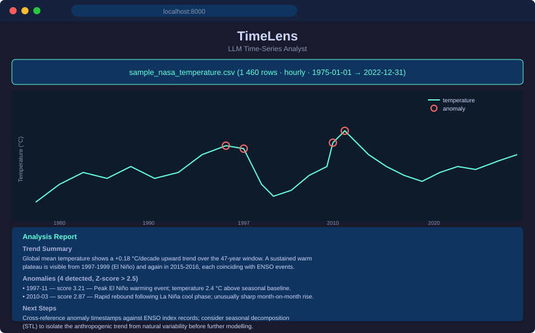

# TimeLens – LLM Time-Series Analyst


> **Video walkthrough:** https://youtu.be/hB7f9eMVDYc
> **60-second overview:** https://youtu.be/m9FM9qLtY9k

> Drop a CSV time series; get anomaly detection, trend analysis, and LLM-generated plain-English explanations in seconds.

<!-- TODO: replace with a 5-10 second demo gif. Record with ScreenToGif on
     Windows or peek on macOS. Save to docs/demo.gif and update path here. -->


## What it is

TimeLens accepts any CSV file containing timestamped numerical data and returns a single-page analysis report. Under the hood it runs a five-stage pipeline: ingest and normalize the CSV, detect anomalies using Z-score and IQR methods, render an interactive Plotly chart with anomaly points marked in red, then call Claude to produce a structured narrative covering trend summary, per-anomaly explanation, and suggested next steps.

The intended users are engineers, ops teams, and analysts who need to turn raw spikes and dips into actionable prose without building a BI pipeline. Upload your CSV, get a report. No account, no dashboard, no model training required.

## Quickstart

```bash
git clone https://github.com/RitikPatill/timelens-llm-ts-analyst.git
cd timelens-llm-ts-analyst
python -m venv .venv
source .venv/bin/activate          # Windows: .venv\Scripts\activate
pip install -r requirements.txt
pip install -e .

export ANTHROPIC_API_KEY=sk-...    # Windows: set ANTHROPIC_API_KEY=sk-...

# run all tests (no API key needed):
TIMELENS_OFFLINE=1 pytest tests/

# start the server:
python run.py
# open http://localhost:8000
```

Drop `data/sample_nasa_temperature.csv` into the upload box to see a live example with NASA hourly temperature data.

## Usage

**Browser UI**: Open `http://localhost:8000`, drag a CSV onto the drop zone, optionally adjust the Z-score threshold (default 2.5), and click Analyze. The Plotly chart and LLM narrative render inline within a few seconds. No page reload.

**API**: Send a `POST /analyze` with the CSV as a multipart file and an optional `threshold` query parameter:

```bash
curl -X POST "http://localhost:8000/analyze?threshold=2.5" \
     -F "file=@data/sample_nasa_temperature.csv"
```

Response shape:

```json
{
  "chart_html": "<div>...</div>",
  "report": {
    "trend_summary": "...",
    "anomaly_explanations": ["...", "..."],
    "next_steps": "..."
  }
}
```

The endpoint returns HTTP 400 with a descriptive message for CSVs missing a timestamp column or lacking numeric columns.

## Architecture

```
CSV upload (multipart/form-data)
        │
        ▼
   ingest.py — auto-detect timestamp + numeric cols,
               resample to uniform freq, forward-fill gaps
        │
        ▼
   detect.py — Z-score (configurable) + IQR flagging
               → is_anomaly bool, anomaly_score float
        │
        ├──────────────────────────────────┐
        ▼                                  ▼
   visualize.py                       report.py
   Plotly line chart                  Structured prompt →
   + red anomaly markers              Claude claude-opus-4-6
   → self-contained HTML div          → JSON report fields
        │                                  │
        └──────────────┬───────────────────┘
                       ▼
             FastAPI POST /analyze → JSON response
                       │
                       ▼
             HTML frontend (GET /) — inline render
```

## Project structure

```
timelens-llm-ts-analyst/
├── src/timelens/
│   ├── ingest.py       # CSV ingestion and preprocessing pipeline
│   ├── detect.py       # Anomaly detection — Z-score + IQR
│   ├── visualize.py    # Plotly chart generation
│   ├── report.py       # Claude LLM narrative report builder
│   └── api.py          # FastAPI application (GET /, POST /analyze)
├── tests/              # 33 tests across all modules (pytest)
│   └── fixtures/       # Sample hourly-temperature CSV
├── data/               # sample_nasa_temperature.csv for manual testing
├── docs/               # Static assets (sample output SVG, demo gif)
├── run.py              # Entry point: uvicorn on :8000
├── requirements.txt    # Pinned dependencies
└── pyproject.toml      # Package metadata (Python 3.11+)
```

## Roadmap

- [ ] Multi-variate analysis — detect correlations across columns
- [ ] Real-time streaming via WebSocket for live sensor feeds
- [ ] Docker image for one-command deployment
- [ ] Persistent analysis history with exportable PDF reports
- [ ] Configurable LLM provider (swap Claude for other models)

## License

MIT — see [LICENSE](LICENSE).

---

Built autonomously by [autodev](https://github.com/RitikPatill/autodev),
a multi-agent orchestrator I designed. Each commit in this repo was
authored by me; the implementation work was performed by Sonnet under
the orchestrator's control. Read the orchestrator's README to see how.
